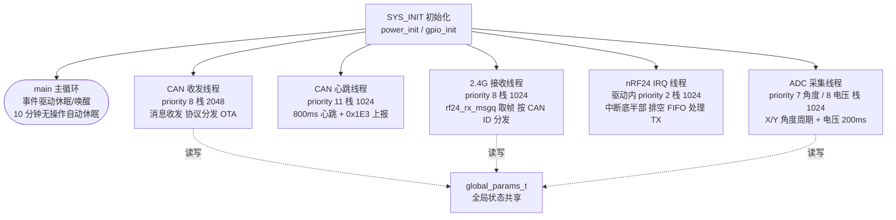
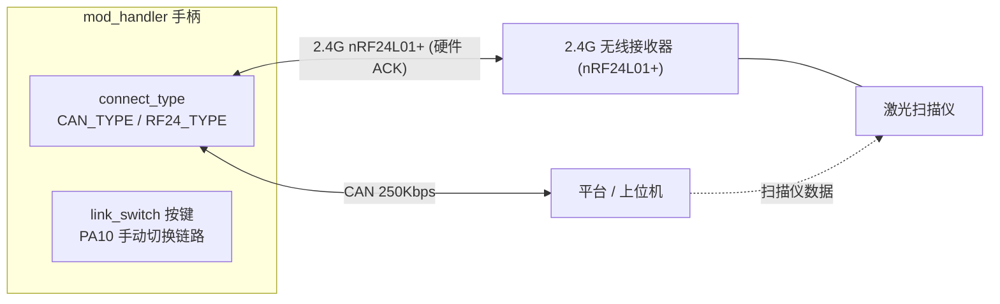
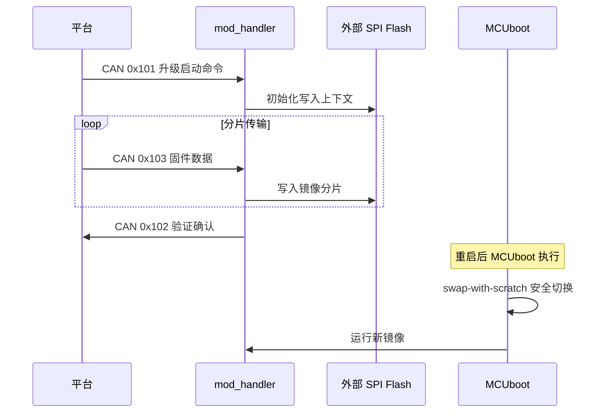
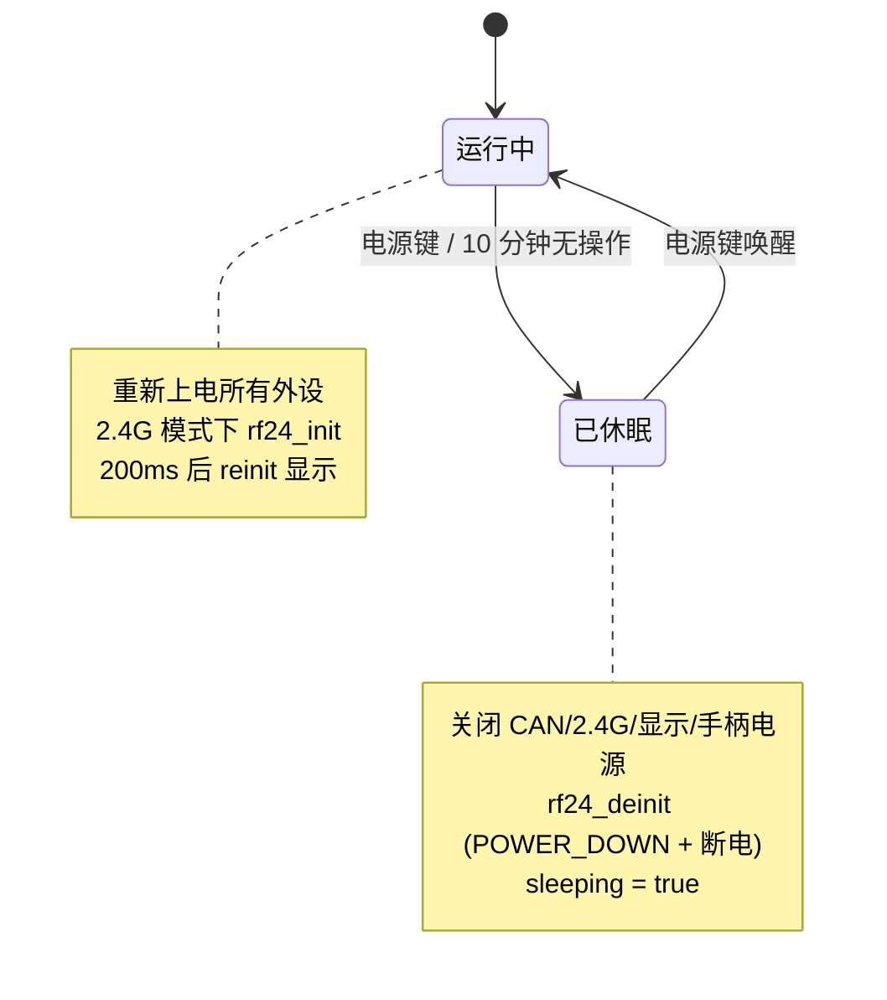
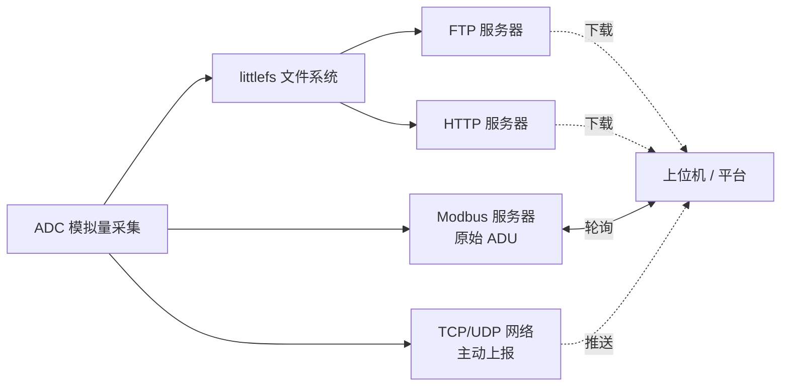
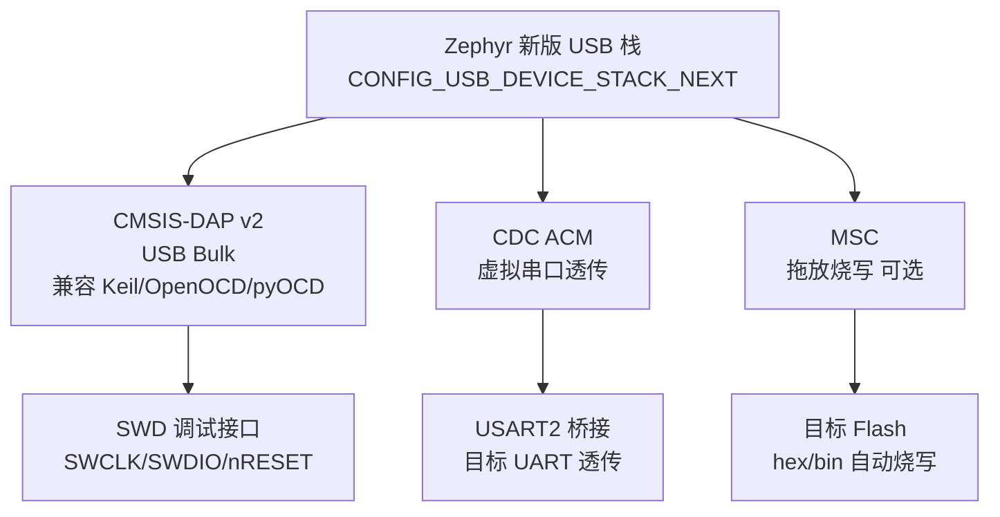

# 架构概览

本页用 [Mermaid](https://mermaid.js.org/) 图表展示核心应用的系统架构、通信链路与关键流程，帮助快速建立整体认知。

## mod_handler 系统架构

mod_handler 采用 Zephyr 多线程架构，通过 `gloval_params_t` 全局结构体共享状态，`k_event` 跨线程通知，外围设备电源由 GPIO 统一管理。

### 线程模型

### CAN / 2.4G 通信链路

双通道冗余链路，默认 CAN，可通过 link_switch 按键（PA10）手动切换。切换时关闭对方电源并重新初始化。帧 ID 详见 [mod_handler 文档](applications/mod-handler.md)。

### OTA 固件升级流程

固件通过 CAN 总线分片传输，写入外部 SPI Flash（GD25Q80），由 MCUboot 以 swap-with-scratch 模式完成安全切换。

### 系统休眠 / 唤醒状态机

电源键触发或 10 分钟无操作自动休眠，关闭所有外设电源（CAN / 2.4G / 显示 / 手柄）；唤醒时重新上电并刷新显示。

## data_collect 数据流

数据采集应用的多通道上报架构：

## ZephyrLink USB 复合设备

CMSIS-DAP 调试探针的 USB 设备拓扑：

!!! tip "深入阅读"
    各应用的完整协议、引脚、Shell 命令详见 [应用模块](applications/mod-handler.md)。
